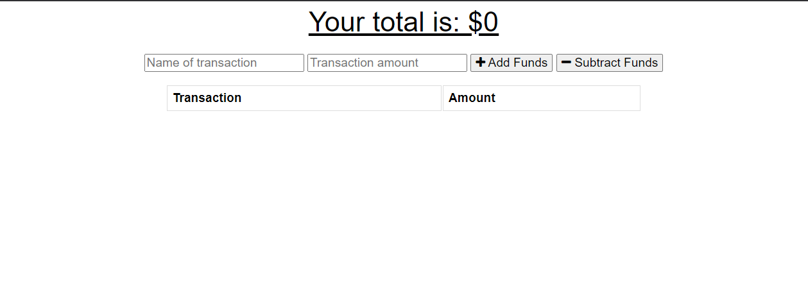
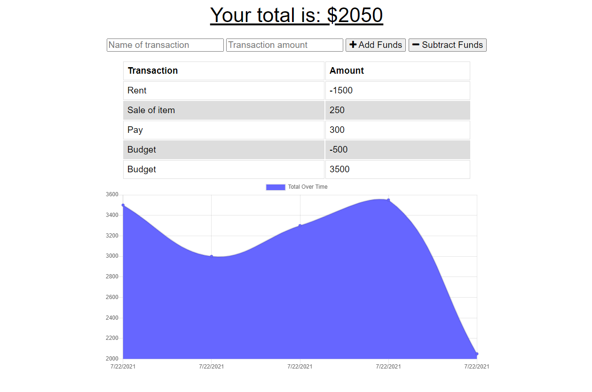
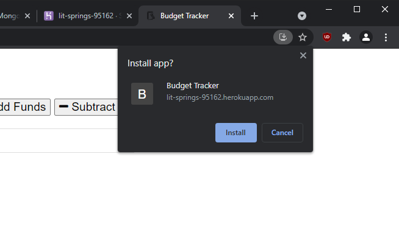

# Budget-Tracker-PWA
## About Budget-Tracker-PWA

The purpose of this educational assignment was to practice developing progressive web applications (PWA) with NoSQL databases using mongoose and MongoDB, by creating and deploying a budget tracker.

1. Present user with homepage to create a budget.
2. User can add or subtract a budget amount by entering a 'transaction name' and 'transaction amount'.
3. Users are then able to click 'add funds' or 'subtract funds' to manipulate the budget.
4. Users are able to see an updated total at the top with their current budget amount.
5. Users are able able to see input transaction history.
6. Additionally, users are also able to view graph data of their budget history.
7. Users can also download an 'offline' version.
8. Once back 'online' user data should be updated.

## Use:

User can add/subtract from a budget and track their progress.

Install:

If running on local machine to test run:
* npm i
* npm install mongodb
* npm install mongoose
* npm run start

*Used to learn, practice, test, understand, and implement various fullstack dev and database deployment (mongoose/mongodb/Heroku/mongoAtlas) tools: 

* PWA (progressive web apps)
* service-workers
* manifest
* NoSQL databases
* mongoose
* Heroku deployment
* Creating a MongoDB Atlas cloud db
* Create and display routes 
* Create and use mongoose schema

## Contacts/Deployed links:

* https://github.com/kitclong/Budget-Tracker-PWA
* https://lit-springs-95162.herokuapp.com/

## Acknowledgments:

* mongoDB and mongo atlas
* mongoose
* Heroku
* npm
* MDN Web Docs
* w3schools
* Stackoverflow
* Trilogy Education services (classwork)
* Additional private tutoring
